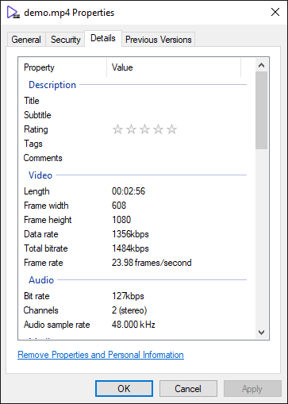

# RightProperties

`RightProperties` is a sample console app written in .NET, which produces properties of files on **Windows** in JSON format.



On Windows, to lookup the properties of a file, you right-click on it and select *Properties* item of the menu. That's the name, `RightProperties`, comes from.

## Quick Start

Following command retrieves all properties of files under `$FOLDER_PATH` recursively:

```powershell
RightProperties.exe $FOLDER_PATH
```

, which saves a `props.${DateTime.Now}.json` file with following content:

```jsonc
[
    // ...
    {
        "System.DateAccessed": "2023-08-26T12:23:00+08:00",
        "System.ItemPathDisplay": "C:\\Projects\\RightProperties\\Demos\\demo.mp4",
        "System.Video.FrameRate": 23976,
        "System.MIMEType": "video/mp4",
        "System.ParsingName": "demo.mp4",
        "System.Video.EncodingBitrate": 1356936,
        "System.Video.IsSpherical": false,
        "System.FileAttributes": 32,
        "System.Audio.ChannelCount": 2,
        "{9E5E05AC-1936-4A75-94F7-4704B8B01923} 0": "demo.mp4",
        "System.ShareScope": "Projects\\RightProperties\\Demos",
        "System.Security.AllowedEnterpriseDataProtectionIdentities": [
            ""
        ],
        "System.Link.TargetExtension": null,
        "System.Document.DateSaved": "2023-08-05T22:03:02.1249333+08:00",
        "System.NetworkLocation": null,
        "System.ThumbnailCacheId": 8093909192380025925,
        "System.Video.HorizontalAspectRatio": 1215,
        "System.ExpandoProperties": null,
        "System.DateCreated": "2023-08-05T22:02:22+08:00",
        "System.ItemTypeText": "MP4 File",
        "System.Link.TargetSFGAOFlagsStrings": null,
        "System.FileOwner": "DESKTOP-DEMO\\RightProperties",
        "System.Media.DlnaProfileID": [
            "AVC_MP4_HP_HD_AAC"
        ],
        "System.SharedWith": null,
        "System.IsShared": false,
        "System.VolumeId": "5c97d01b-0000-0000-0000-508604000000",
        "System.SyncTransferStatusFlags": null,
        "System.AppUserModel.ID": null,
        "{CFA31B45-525D-4998-BB44-3F7D81542FA4} 1": "AVC_MP4_HP_HD_AAC",
        "System.Document.DateCreated": "2023-08-05T22:02:22+08:00",
        "System.ItemFolderNameDisplay": "Demos",
        "System.DRM.IsProtected": false,
        "System.Audio.StreamNumber": 1,
        "System.Kind": [
            "video"
        ],
        "System.LastWriterPackageFamilyName": null,
        "System.Video.TotalBitrate": 1484632,
        "System.NotUserContent": false,
        "System.FileExtension": ".mp4",
        "System.AppZoneIdentifier": null,
        "System.ParsingPath": "C:\\Projects\\RightProperties\\Demos\\demo.mp4",
        "System.ItemName": "demo.mp4",
        "System.ItemPathDisplayNarrow": "demo (C:\\Projects\\RightProperties\\Demos)",
        "System.Security.EncryptionOwnersDisplay": null,
        "System.Link.TargetSFGAOFlags": null,
        "System.FileName": "demo.mp4",
        "System.StorageProviderAggregatedCustomStates": null,
        "System.Video.FrameHeight": 1080,
        "System.KindText": "Video",
        "System.Media.Duration": 1765100000,
        "System.FileAttributesDisplay": null,
        "System.ItemFolderPathDisplay": "C:\\Projects\\RightProperties\\Demos",
        "System.DateModified": "2023-08-05T22:03:02.1249333+08:00",
        "System.ItemNameDisplayWithoutExtension": "demo",
        "System.Video.VerticalAspectRatio": 1216,
        "System.Audio.SampleRate": 48000,
        "System.Video.IsStereo": false,
        "System.ItemNameDisplay": "demo.mp4",
        "System.Audio.SampleSize": 16,
        "System.SharingStatus": 2,
        "System.Video.FrameWidth": 608,
        "{46802C11-ADA9-41B7-8EBE-65BA6699358B} 100": 1,
        "System.Shell.SFGAOFlagsStrings": [
            "filesys",
            "stream"
        ],
        "System.Security.EncryptionOwners": null,
        "System.ZoneIdentifier": 3,
        "System.AppUserModel.ParentID": null,
        "System.Audio.EncodingBitrate": 127696,
        "System.Audio.Format": "{00001610-0000-0010-8000-00AA00389B71}",
        "System.Size": 32899952,
        "System.Video.Orientation": 0,
        "System.ItemDate": "2023-08-05T22:02:22+08:00",
        "System.SFGAOFlags": 1077936503,
        "System.Video.Compression": "{34363248-0000-0010-8000-00AA00389B71}",
        "System.ComputerName": "DESKTOP-DEMO",
        "System.ItemFolderPathDisplayNarrow": "Demos (C:\\Projects\\RightProperties)",
        "System.IsFolder": false,
        "System.OfflineStatus": null,
        "System.OfflineAvailability": null,
        "System.Video.FourCC": 875967048,
        "System.DateImported": "2023-08-05T22:02:22+08:00",
        "System.FilePlaceholderStatus": 6,
        "System.Video.StreamNumber": 2,
        "System.Link.TargetParsingPath": null,
        "System.ContentType": "video/mp4",
        "System.PerceivedType": 4,
        "System.ItemType": ".mp4"
    }
    // ...
]
```

Currently, `RightProperties` only works on **Windows**.

## Options

### `--no-recursive`

`--no-recursive` tells `RightProperties` to not lookup sub-folders of `$FOLDER_PATH`.

By default, `RightProperties` checks all files of given `$FOLDER_PATH` recursively.

### `--no-video-missing-props-probe`

`--no-video-missing-props-probe` tells `RightProperties` to not probe missing properties of video files.

By default, `RightProperties` probes missing properties of video files via `ffprobe`. Please refer to [Video Files and The Properties](#video-files-and-the-properties) section to get more details.

*If you don't care the missing properties of video files, you can provide this flag to reduce execution time.*

### `--ffprobe-bin $BIN_PATH`

`--ffprobe-bin` tells `RightProperties` to use provided path to execute `ffprobe`. (*Only works if `--no-video-missing-props-probe` is `false`*)

By default, `RightProperties` uses `ffprobe` as [`ProcessStartInfo.FileName`](https://learn.microsoft.com/en-us/dotnet/api/system.diagnostics.processstartinfo.filename) to start process.

### `--log-level`

Available: `debug`, `info`, `warn`, `error` and `silent`\
Default: `info`

## The Structure of JSON Output

Note that the output doesn't follow the structure of the folder you query, `RightProperties` collects all files as one-level flatted array. You can use [`System.ItemFolderNameDisplay`](https://learn.microsoft.com/en-us/windows/win32/properties/props-system-itemfoldernamedisplay)
or [`System.ItemFolderPathDisplay`](https://learn.microsoft.com/en-us/windows/win32/properties/props-system-itemfolderpathdisplay)
to group files up.

## Windows Property System

The names of properties with `System` prefix are *Canonical Name* from [propertyDescription](https://learn.microsoft.com/en-us/windows/win32/properties/propdesc-schema-propertydescription#attributes)
which describes a single unique canonical property used by the Windows Property System.
You can find the whole definition at [here](https://learn.microsoft.com/en-us/windows/win32/properties/props).

## Video Files and The Properties

The original purpose of this project is to retrieve properties of video files for management. So `RightProperties` only focuses on video files properly.

### The Missing Properties

The properties/metadata are retrieved by [Property Handlers](https://learn.microsoft.com/en-us/windows/win32/properties/building-property-handlers-properties)(with specific file types).
Sometimes, the properties can't be retrieved which may be caused by wrong file extensions or the property handler doesn't implement the properties.

If following properties of video files are missing, `RightProperties` uses [`ffprobe`](https://ffmpeg.org/ffprobe.html) to fetch.

1. `System.Media.Duration`
2. `System.Video.FrameWidth`
3. `System.Video.FrameHeight`
4. `System.Video.EncodingBitrate`
5. `System.Video.TotalBitrate`
6. `System.Video.FrameRate`
7. `System.Audio.EncodingBitrate`
8. `System.Audio.ChannelCount`
9. `System.Audio.SampleRate`

These properties are displayed on the *Details* tab of the *Properties* dialog box and belong to [groups](https://learn.microsoft.com/en-us/windows/win32/properties/propgroup-bumper)
`System.PropGroup.Video` and `System.PropGroup.Audio`.

If the properties are fetched by `ffprobe`, the prefix of name will be `FFProbe` instead of `System`.

```jsonc
{
    // ...
    "FFProbe.Media.Duration": "176.509667", // second.
    "FFProbe.Video.FrameWidth": 608,
    "FFProbe.Video.FrameHeight": 1080,
    "FFProbe.Video.EncodingBitrate": "1360709", // bit per second.
    "FFProbe.Video.TotalBitrate": "1491134", // bit per second.
    "FFProbe.Video.FrameRate": "24000/1001",
    "FFProbe.Audio.EncodingBitrate": "128042", // bit per second.
    "FFProbe.Audio.ChannelCount": 2,
    "FFProbe.Audio.SampleRate": "48000" // hertz.
    // ...
}
```

**To reduce complexity, `RightProperties` won't fetch metadata from the video if the number of streams isn't 2 or the stream is neither video nor audio.**

### Calculation of Bitrate

`RightProperties` calculates bitrate of video or audio streams ***approximately*** when `ffprobe` is unable to fetch bitrate set by encoders. The name of calculated properties are `FFProbe.Video.EncodingBitrate.Calculated` and `FFProbe.Audio.EncodingBitrate.Calculated`.

```jsonc
{
    "FFProbe.Video.EncodingBitrate.Calculated": "1360709",
    "FFProbe.Audio.EncodingBitrate.Calculated": "128073"
}
```

### Extra Properties

If `ffprobe` is able to fetch metadata from video container, `RightProperties` will add the key, `FFProbe.Format.Tags`, with the metadata to the JSON output. If `FFProbe.Format.Tags` has `"artist"` or `"album_artist"` key/value pair, that value with the key, `FFProbe.Music.Artist`, will be added to JSON as well.

```json
{
    "FFProbe.Format.Tags": {
        "major_brand": "isom",
        "minor_version": "512",
        "compatible_brands": "isomiso2avc1mp41",
        "encoder": "Lavf59.27.100",
        "artist": "demo"
    },
    "FFProbe.Music.Artist": "demo"
}
```

## FAQ

### `probe_score`

>>The `probe_score` field in the output of `ffprobe` is an internal score that represents the reliability or confidence level of the media file probe. It indicates how certain `ffprobe` is about the correctness of the format or codec detection for the given file.
>>
>>- A higher `probe_score` typically indicates a higher level of confidence in the detected format or codec.
>>- A lower `probe_score` suggests that `ffprobe` may be less certain about the detected format or codec.
>>- A `probe_score` of 100 is often used when `ffprobe` is very confident about the detected format or codec.
>>
> \- From ChatGPT
